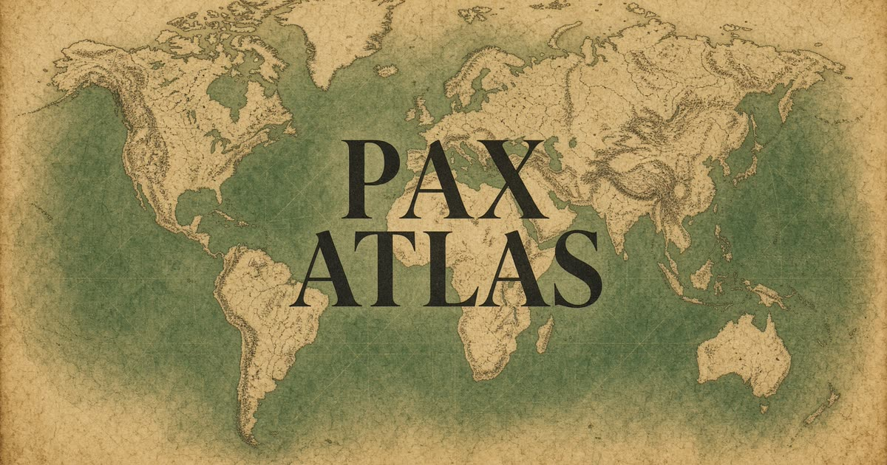

# Pax Atlas

[](https://github.com/GizzZmo/UNC/actions/workflows/ci.yml)
[](https://github.com/GizzZmo/UNC/actions/workflows/codeql.yml)

An editorial guide to world peace initiatives — and a standing offer you can sign.

**[The Pact](#the-pact)** · Atlas · Initiatives · Timeline · Ways to act



## What it is

Pax Atlas is a magazine-style web app that maps the work of peace: UN missions, humanitarian law, nuclear treaties, local mediators, and youth encounter programmes. It is independent editorial — not affiliated with the United Nations or the organizations profiled.

Facts in the atlas are current as of 2026.

## The Pact

*To All Who Share This Earth* is a personal peace agreement initiated by **Jon Constantine**. It is not a treaty of states. It is a standing offer of non-aggression, shared stewardship, and restorative dialogue, open to anyone who chooses to affix their name.

> Peace is not the absence of conflict, but the deliberate decision to meet it without destruction.

Signatures are stored only on the signer’s device (local storage). They are a personal pledge, not a public ledger.

## Features

| Surface | What you can do |
| --- | --- |
| **The Pact** | Read the three articles and sign with a printed name |
| **Atlas** | Browse initiatives by world region |
| **Initiatives** | Filter 16 profiles by practice, region, or a local shortlist |
| **Timeline** | Walk accords from Westphalia to the Pact for the Future |
| **Act** | Six concrete next steps (local peacebuilders, unarmed protection, ICRC, ICAN, …) |

## Stack

- [React](https://react.dev/) 19 and [TanStack Start](https://tanstack.com/start) / Router
- [Tailwind CSS](https://tailwindcss.com/) v4
- [Vite](https://vite.dev/) 8
- [Zustand](https://github.com/pmndrs/zustand) for saved initiatives and local pact signatures
- Node.js 22

No accounts and no database. Auth stays off. Pact names never leave the browser.

## Local development

```bash
git clone https://github.com/GizzZmo/UNC.git
cd UNC
npm ci
npm run dev
```

The app listens on `http://localhost:8080`.

| Script | Purpose |
| --- | --- |
| `npm run dev` | Development server |
| `npm run build` | Production build |
| `npm run typecheck` | TypeScript (`tsc --noEmit`) |
| `npm test` | Grok builder self-tests (some read `site.json`) plus app unit tests |
| `npm run lint` | ESLint |
| `npm run format` | Prettier |

CI on GitHub runs lint, the app unit tests, typecheck, and the production build. It does not run the Grok-platform self-tests, which assert sandbox identity independent of this app.

## Continuous integration

GitHub Actions run on every push and pull request to `main`:

1. **CI** — `npm ci`, lint, unit tests, typecheck, production build. Actions are pinned to full commit SHAs. The workflow has `contents: read` only and cancels superseded runs.
2. **CodeQL** — JavaScript/TypeScript security analysis (`security-extended` queries), plus a weekly Monday scan.
3. **Dependabot** — weekly grouped updates for GitHub Actions and npm.

## Project layout

```text
src/
  routes/          Pages (home, pact, atlas, initiatives, timeline, act)
  data/            Initiative catalog and pact text
  components/      Shell, cards, UI primitives
  lib/             Saved shortlist and local pact signatures
public/images/     Editorial photography
.github/workflows/ CI and CodeQL
```

## Credits

Pact initiated by Jon Constantine. Profiles describe real organizations from public sources. Built with the Grok App Builder on TanStack Start.

This repository is an independent editorial project. It is not a legal instrument of public international law.
